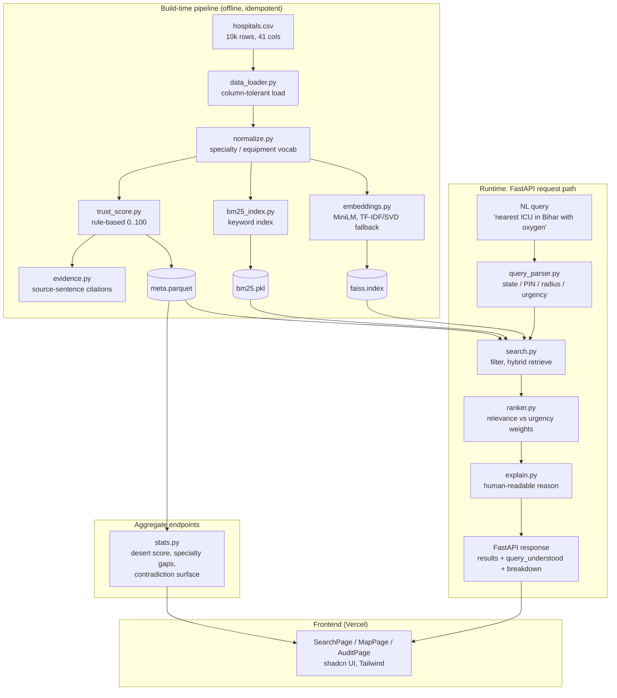

# CareGrid AI

> An agentic healthcare-intelligence layer for the Hack-Nation
> *Serving a Nation* challenge. Hybrid retrieval over 10,000 messy Indian
> facility records, with a transparent trust scorer that cites the exact
> sentence in each hospital's notes.

CareGrid AI takes a free-text question like
*"nearest ICU hospital in Bihar with oxygen, within 30 km of 800001"*
and returns ranked, location-aware results, each annotated with a
0-100 trust score and the source sentence that justifies every point on
the score. The service is deterministic, runs on CPU, and ships as a
single Docker image suitable for the Hugging Face Spaces free tier.

---

## Repository contents

| Path                                | Purpose                                                            |
| ----------------------------------- | ------------------------------------------------------------------ |
| `backend/`                          | FastAPI service: hybrid search, trust scoring, evidence citations  |
| `frontend/care-connect-ai-main/`    | React + Vite + Tailwind + shadcn UI consuming the backend          |
| `data/`                             | Source CSVs (10k facilities, PIN centroids) + challenge brief PDF  |
| `docs/`                             | Challenge audit, deploy runbook, Lovable prompt, architecture ref. |
| `Dockerfile`                        | Hugging Face Spaces image (Docker SDK, port 7860)                  |
| `pytest.ini`                        | Test discovery configuration                                       |

---

## End-to-end flow

The diagram below traces a single request from the raw 10k-row CSV all
the way to a rendered result card in the frontend. Every box maps to a
file in the repository.



A textual recap, in case the Mermaid block fails to render:

```
hospitals.csv  ->  load + normalize  ->  trust score + evidence
                                   |->  MiniLM / TF-IDF embeddings  ->  FAISS
                                   |->  BM25 keyword index
                                   `->  meta.parquet (cached)

NL query  ->  rule-based parser  ->  filter (state/PIN radius)
                                ->  hybrid retrieve (FAISS + BM25)
                                ->  rank (relevance vs urgency)
                                ->  explain  ->  JSON response  ->  React UI
```

---

## Challenge mapping

| Brief requirement                                     | Implementation                                       |
| ----------------------------------------------------- | ---------------------------------------------------- |
| MVP1 — Massive Unstructured Extraction                | `backend/app/data_loader.py`, `normalize.py`         |
| MVP2 — Multi-Attribute Reasoning                      | `backend/app/query_parser.py`, `search.py`           |
| MVP3 — Trust Scorer with contradiction rule           | `backend/app/trust_score.py`                         |
| Stretch — Agentic Traceability (row-level citations)  | `backend/app/evidence.py` + `trust_score.py`         |
| Stretch — Dynamic Crisis Mapping                      | `backend/app/stats.py` + `/stats/*` endpoints        |

Full audit: [`docs/CHALLENGE_AUDIT.md`](docs/CHALLENGE_AUDIT.md).
Backend deep-dive: [`backend/README.md`](backend/README.md).
Future architecture reference (Databricks/Mosaic version):
[`docs/ARCHITECTURE_REFERENCE.md`](docs/ARCHITECTURE_REFERENCE.md).

---

## Local quick start

```bash
python -m venv .venv
# Windows
.venv\Scripts\Activate.ps1
# macOS / Linux
source .venv/bin/activate

pip install -r backend/requirements.txt
python -m backend.scripts.build_index
uvicorn backend.app.main:app --reload --port 8000
# Swagger UI -> http://localhost:8000/docs
```

Frontend:

```bash
cd frontend/care-connect-ai-main
npm install
cp .env.example .env.local   # set VITE_API_BASE_URL
npm run dev
```

Tests:

```bash
pytest                       # backend
cd frontend/care-connect-ai-main && npm test   # frontend
```

---

## Deployment

This single repository deploys to two surfaces:

1. **Backend** to Hugging Face Spaces via the Docker SDK
   ([`docs/DEPLOY_HUGGINGFACE.md`](docs/DEPLOY_HUGGINGFACE.md)).
2. **Frontend** to Vercel from the `frontend/care-connect-ai-main`
   subdirectory. Environment variable `VITE_API_BASE_URL` points the
   client at the deployed Space.

After the first backend deploy, set `CAREGRID_CORS_ORIGINS` on the
Space to the Vercel URL and restart so CORS allows the production
frontend.

---

## HCI principles applied

The interface and API were designed against established
human-computer-interaction heuristics. The most load-bearing ones:

- **Visibility of system status.** Every `/search` response includes a
  `query_understood` block showing the parsed state, PIN, radius,
  specialties, requirements and chosen sort order. The UI surfaces this
  as a "We understood you meant..." chip-row, plus a `score_components`
  panel that breaks down semantic, keyword, trust and location
  contributions per result.
- **Match between system and the real world.** Queries use natural
  language and domain vocabulary (ICU, dialysis, ventilator, "within
  30km of 800001", state names and abbreviations). No filter UI is
  required to ask the question.
- **User control and freedom.** Filters detected from natural language
  are reversible: the user can edit the search string, switch between
  relevance and proximity sort, or open `MapPage` to pan the choropleth.
  Pages are URL-addressable so a result is shareable.
- **Consistency and standards.** REST conventions, JSON everywhere,
  Pydantic-validated payloads, an auto-generated OpenAPI/Swagger UI at
  `/docs`. Typography and spacing follow shadcn/Tailwind defaults.
- **Error prevention.** The encoder layer auto-detects and falls back
  from MiniLM to a TF-IDF + SVD path so a missing C++ runtime cannot
  brick the system. The dataset loader accepts column-name variants
  (`name`/`hospital`, `pin`/`pincode`/`zip`) so a slightly different
  CSV does not break ingestion.
- **Recognition over recall.** Each result carries a colour-coded
  trust badge, evidence snippets, matched-feature chips and a
  human-readable explanation string, so users do not need to remember
  what triggered the rank.
- **Aesthetic and minimalist design.** Information is layered:
  a single trust number at first glance, expandable into the rule
  breakdown, expandable into the source-sentence citation. No detail
  is shown that the user did not ask to see.
- **Help users recognise, diagnose and recover.** The `/health`
  endpoint reports dataset rows, FAISS load state, active encoder, and
  pincode coverage, so misconfiguration is visible rather than silent.
  `/admin/reindex` lets an operator recover from a bad dataset drop
  without restarting the server.
- **Accessibility.** The frontend is built on Radix-based shadcn
  primitives, which ship keyboard navigation, focus-trap and ARIA
  attributes by default. Colour is never the sole carrier of meaning
  (trust score is shown as number + label + bar).

---

## Software-engineering principles applied

- **Separation of concerns.** The backend is a graph of small modules,
  each with one job: `data_loader`, `normalize`, `embeddings`,
  `bm25_index`, `query_parser`, `search`, `ranker`, `trust_score`,
  `evidence`, `explain`, `stats`, `geo`, `schemas`.
- **Schema-first API.** All request and response shapes live in
  `backend/app/schemas.py` (Pydantic). FastAPI generates the OpenAPI
  contract from those models, and the TypeScript client in
  `frontend/care-connect-ai-main/src/lib/types.ts` mirrors them, so
  drift is caught at compile time on the frontend.
- **Configuration as code, plus 12-factor overrides.** Tunables
  (weights, TOP_K, model name) live in `backend/app/config.py`.
  Environment variables (`CAREGRID_DATA_DIR`, `CAREGRID_CORS_ORIGINS`,
  `CAREGRID_ENCODER`, `PORT`) override them without code changes, which
  is how the same image runs locally, in CI, and on Hugging Face.
- **Pluggable strategy with a single interface.** The encoder layer
  exposes one `encode()` contract and quietly chooses between
  Sentence-Transformers MiniLM and a sklearn TF-IDF + Truncated-SVD
  fallback. The ranker and FAISS are unaware of which path was taken.
- **Determinism and reproducibility.** Index artifacts
  (`faiss.index`, `bm25.pkl`, `meta.parquet`, optional `encoder.pkl`)
  are content-derived from the input CSV. The Docker build pre-builds
  them so cold-start is fast and identical across machines.
- **Idempotent build pipeline.** `python -m backend.scripts.build_index`
  is safe to rerun; the `POST /admin/reindex` endpoint exposes the same
  operation behind the API for live ops.
- **Fail-fast at the edges, graceful where it matters.** Pydantic
  rejects malformed requests at the boundary; internally, missing
  columns, empty notes, and offline model downloads all degrade to
  sensible defaults rather than 500-ing.
- **Test pyramid.** Unit tests for the deterministic pieces (parser,
  trust score, normaliser, encoder fallback) plus an end-to-end
  `test_search.py` that auto-skips if the heavy ML deps are not
  installed. Frontend uses Vitest + Testing Library.
- **Containerised, layer-cached deploys.** The `Dockerfile` orders
  steps so the expensive layers (apt, pip install, MiniLM weights,
  index build) sit above the source copy. A code-only change rebuilds
  in roughly two minutes instead of ten.
- **Single source of truth for the dataset.** `data/hospitals.csv` is
  the only authoritative input; everything downstream is derived. PIN
  centroids in `data/pincodes.csv` are similarly bundled so the same
  artifact runs anywhere.
- **Documentation treated as a deliverable.** Each subsystem has its
  own README; the deploy runbook, the challenge audit, and the future
  architecture reference all live in `docs/` and are kept in lockstep
  with the code.

---

## Stack at a glance

- **Language / runtime:** Python 3.11, Node 20.
- **Backend:** FastAPI, Uvicorn, Pydantic v2, FAISS-cpu, rank_bm25,
  sentence-transformers (MiniLM-L6-v2) with sklearn TF-IDF/SVD
  fallback, pandas, numpy.
- **Frontend:** React 18, Vite, TypeScript, Tailwind, shadcn/ui
  (Radix), TanStack Query, react-simple-maps, Vitest.
- **Container / hosting:** Docker, Hugging Face Spaces (backend),
  Vercel (frontend).
- **Testing:** pytest, vitest, @testing-library/react.

---

## License

MIT. See file headers for third-party attributions.
